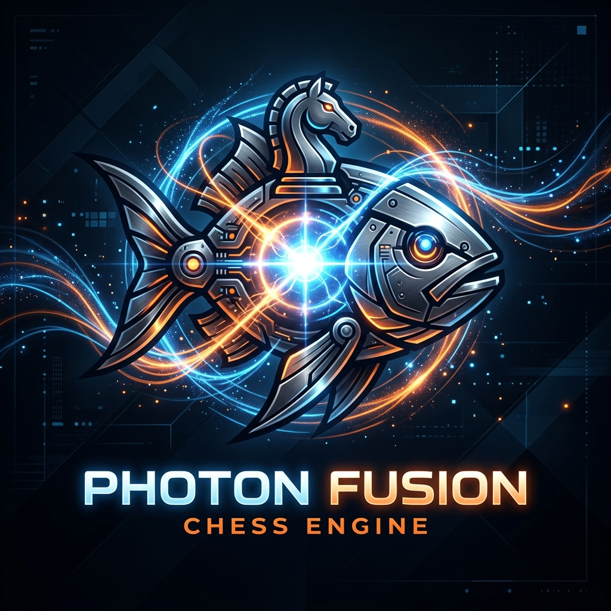

# ⚛️ Photon Fusion v2.0
> **The Ultimate Hybrid Chess Intelligence.**



[](https://opensource.org/licenses/MIT)
[]()
[]()

**Photon Fusion** is a high-performance chess engine and analysis dashboard that utilizes a surgical tactical search based on the **Photon C++ Engine** architecture.

## 🚀 Key Features

*   **🧠 Evolutionary Brain**: Utilizes advanced position evaluation weights and complex material constants for superior strategic depth.
*   **⚡ Tactical High-Speed Search**: Integrated **Singular Extensions**, **LMR (Late Move Reductions)**, and **SEE (Static Exchange Evaluation)** for professional-level tactical sharpness.
*   **📊 Dynamic Analysis Dashboard**: Real-time **MultiPV (3-line)** analysis with interactive move sequence playback. Jump deep into any variation with a single click.
*   **🎨 Premium UI/UX**: A sleek, dark-themed interface inspired by modern professional chess platforms, built for analysis and elite gameplay.
*   **🕒 Hybrid Time Management**: Smart time allocation optimized for both Blitz and classical time controls.

## 🛠️ Getting Started

### Prerequisites
*   Python 3.10+
*   C++ Compiler (GCC/MinGW) - *Self-compilation script included*

### Installation
1. Clone the repository:
   ```bash
   git clone https://github.com/YOUR_USERNAME/photon-fusion.git
   cd photon-fusion
   ```
2. Start the Fusion Bridge:
   ```bash
   python gui.py
   ```
3. Open your browser:
   Navigate to `http://localhost:8000`

## 📊 Roadmap for Virality
- [ ] **WASM Integration**: Run the entire C++ engine in the browser (Zero installation).
- [ ] **Neural Network Bridge**: Direct integration with advanced neural evaluation networks.
- [ ] **Cloud Analysis**: Global community-powered position database.

## 📜 License
This project is licensed under the MIT License - see the [LICENSE](LICENSE) file for details.

---
*Created with ❤️ by the Photon Fusion Team. Rule the board.*
